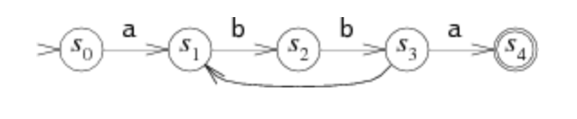

# Week of 28/01/2024
https://github.com/nanopass/nanopass-framework-scheme/blob/main/ReadMe.md

https://docs.racket-lang.org/nanopass/index.html#%28form._%28%28lib._nanopass%2Fbase..rkt%29._define-pass%29%29

https://www.youtube.com/watch?v=iC8eSdoyu9A -- scheme learning resources

*Thoughts* 

> if we want to do a single (or really just deterministically long pass) of register allocation, all three papers I've read indicate the need to covert into elementary (or semi-elementary) form:\n SSA -> parallel copy -> SSI

**Decoupled Graph-Coloring Register Allocation with Hierarchical Aliasing**

 - seperate spilling and allocation phases -> deterministic/guaranteed to complete & modular
 - utilizes *live range spilling* to allocated a value across multiple registers over it's lifetime
 - *semi elementary form*
    - uses "much less" memory than traditional full elementary form allocators (puzzle solving)
    - 
 - *traditional graph coloring*
    - edge between two variables (nodes) <=> live ranges intersect at a program point (the space between to instructions)
    - var *v* is live @ prog point *p* if the control flow graph of the program contains a path from *p* to an instruction that uses *v*, which does not cross a place where *v* is redefined
    - because the work is iterative, it has to potentially spill, and use registers to do that spill and this check for spills again and so forth, indeterminant, complicated, expensive
 - *decoupled register coloring*

    - **Property 1:** The maximum *local* register pressure @ any point in the program is equal to the *global* register pressure \-\- guaranteed by non aliased SSA (which we have i think?) as a result spilling can be done *in code* without need for an interference graph!

    *generally*
    1. lower register pressure through typical means until coloring is possible on all live variables
    2. use live range splitting to guarantee property 1 \- typically parallel semantic copies are used (still need to know what this is??)
    3. assign vars to registers without spilling, ezpz **OK so possibly make this a pre allocate nanopass? && then simplify the allocate registers? pass**
    4. get rid of $\phi$ functions (do we have these?) && parallel copies 

- **Finally, we provide as a bonus an improved spilling test, that might produce less spilling than the simplification heuristics traditionally used in graph-coloring based register allocation** very interesting!

*Questions*
    
    1. SSA Form? $\phi$ functions? totally forgot from last week
    2. representation of basic blocks?
    3. Parallel copy form representation? 
    4. If we abstract away alliasing do we ever bring it back? if so where?

testing looping
-> printf to serror while running code, load racket files from source
            racket -cl racket
            linklet plt show paseses finalize-register-locations

            x = y 
            a = b
            x,a = y,b 

Linear Scan??
Live range splitting?

*Rhombus*
 - regex sublang
 ==> rhombus repo test suite -> regex space
 ==> 
 - racket has one 
 - no escape characters
 - thesis aproval form -- due two months
 - 

### regular expressions and rhombus
*(primarily taken from https://swtch.com/~rsc/regexp/regexp1.html*)

ex: _three machines representing *a(bb)+a*_:
   
   1. This machine is deterministic, there is no question of which path it will take 
   
   

   2. This machine is nondeterministic, at the S~2~ stage, it can use 'b' to progress or to loop back! how does it know?

   

   3. This is also nondeterministic, instead of splitting on b, it diverges on nothing, ($\varepsilon$), and loops back for the (bb)+ 
   

_coalescing_: one potential thing is doing NFA combinations on |'s to ensure less backtracking e.g. abab|abbb has the same s1, s2, (a -> b) and splits upon exiting s2 to (a -> b -> exit) | (b -> b -> exit) some sort of determined # of post production passes to try and coalesce as needed?
(This is just conversion to DFA's I guess)

Does Racket do this conversion already? if not should we implement it in rhombus?

_back references_
ex: (cat|dog)\1 -> catcat or dogdog (cat|dog)\2 -> catcatcat or dogdogdog etc. but not catdog -> not technically Regex's and have worst case exponential time algorithms :\(

_multi state search_: another thing you can do is to run both NFA's simultaniously, operating on every (viable) branch of the search at once, no backtracking, just linear time progress and cutting upon failure to match
 - "The efficiency comes from tracking the set of reachable states but not which paths were used to reach them. In an NFA with n nodes, there can only be n reachable states at any step, but there might be 2n paths through the NFA"

 __A General Question on Tail Optimization and Inheritence__

// half baked! -- unsure if this is even an issue, or something viable to work on
For something like work/tail_recursion.rhm where a tail recursive call uses a parent class, since the parent classes parameters come first, if you recursed on the function to generated parent class' params would that mess up tail recursion optimization? is there a way to work around this? keywords? or perhaps some behind the scenes reordering of the parameters being passed? Could this mess something else up in a state-ful programming way?
